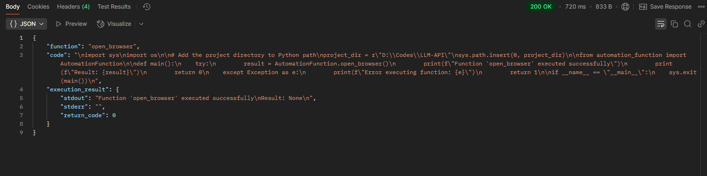
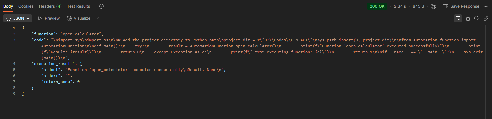
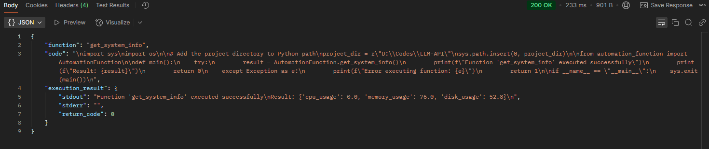
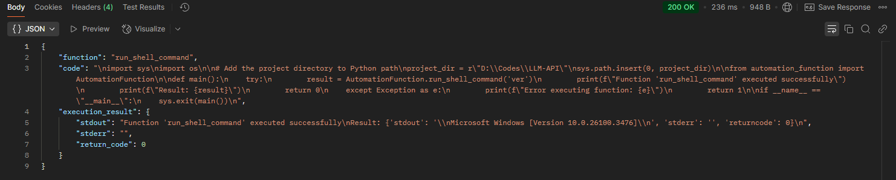

# Automation Function Retrieval System

## Overview

This project is a sophisticated automation system that allows dynamic function retrieval and execution through a FastAPI-powered backend. The system uses advanced semantic search techniques to match user prompts with appropriate system automation functions, enabling flexible and intelligent command execution.

## Key Components

1. **API Endpoint (`api_endpoint.py`)**: 
   - A FastAPI server that handles function execution requests
   - Processes user prompts and maps them to appropriate system functions
   - Provides a secure and structured way to execute automation tasks

2. **Automation Functions (`automation_function.py`)**: 
   - Contains a collection of system-level utility functions
   - Supports tasks like opening applications, retrieving system information, and running shell commands

3. **Function Retrieval (`function_retrieval.py`)**: 
   - Implements semantic search for function matching
   - Uses SentenceTransformer for encoding and ChromaDB for vector-based function retrieval
   - Enables intelligent mapping between natural language prompts and system functions

4. **Code Generation (`code_generator.py`)**: 
   - Dynamically generates executable Python scripts
   - Handles script execution in a controlled, sandboxed environment
   - Provides flexible execution of various system automation functions

## Requirements

- Python 3.8+
- FastAPI
- Pydantic
- SentenceTransformer
- ChromaDB
- Psutil
- Webbrowser

## Installation

1. Clone the repository
```bash
git clone https://github.com/mherenow/LLM-Automation-API.git
```

2. Create a virtual environment
```bash
python -m venv venv
venv\Scripts\activate  # On bash, use `source venv/bin/activate`
```

3. Install dependencies
```bash
pip install -r requirements.txt
```

## Usage

### Running the API Server

```bash
uvicorn api_endpoint:app --reload
```

### Executing Functions via API

The system supports various function executions through a semantic search mechanism:

1. **Open Browser**
   ```
   Prompt: "Open a web browser"
   ```
   

2. **Open Calculator**
   ```
   Prompt: "Launch the calculator"
   ```
   

3. **Get System Information**
   ```
   Prompt: "What are my current system resources?"
   ```
   

4. **Run Shell Command**
   ```
   Prompt: "run command 'ver'"
   ```
   

## How It Works

1. User sends a natural language prompt to the `/execute` endpoint
2. SentenceTransformer encodes the prompt
3. ChromaDB performs semantic similarity search
4. The most relevant function is selected
5. A dynamic execution script is generated
6. The function is executed in a sandboxed environment
7. Results are returned to the user

## Potential Improvements

- Add more sophisticated error handling
- Implement role-based access control
- Expand the function library
